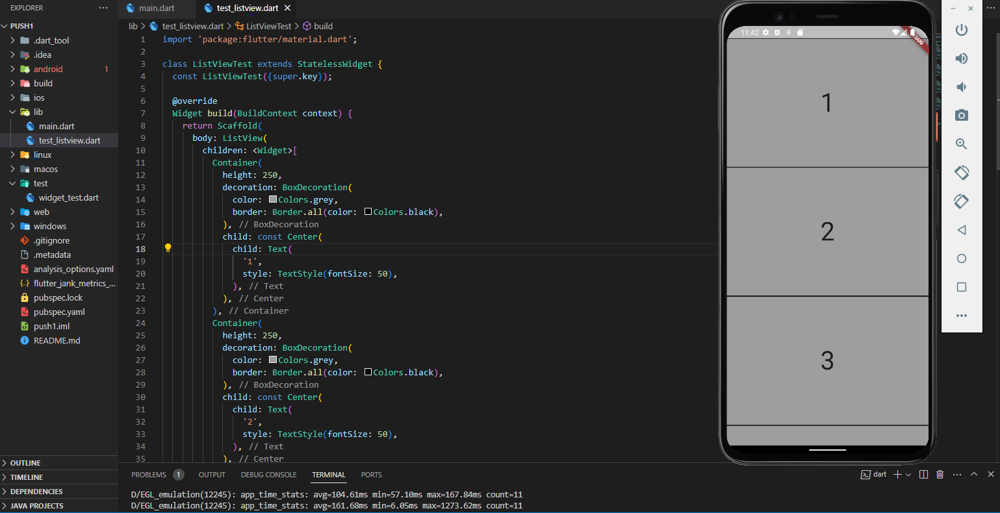

# push1

A new Flutter project.

## Getting Started

This project is a starting point for a Flutter application.

A few resources to get you started if this is your first Flutter project:

- [Lab: Write your first Flutter app](https://docs.flutter.dev/get-started/codelab)
- [Cookbook: Useful Flutter samples](https://docs.flutter.dev/cookbook)

For help getting started with Flutter development, view the
[online documentation](https://docs.flutter.dev/), which offers tutorials,
samples, guidance on mobile development, and a full API reference.

# ListView Test

Ini adalah contoh sederhana penggunaan widget ListView dalam Flutter.

## Deskripsi

Aplikasi ini menggunakan widget `ListView` untuk menampilkan daftar kontainer dengan teks di tengah. Setiap kontainer memiliki tinggi yang sama dan dihias dengan warna abu-abu dengan border hitam.

## Tampilan Aplikasi

Berikut adalah tampilan dari aplikasi yang dihasilkan:

## Cara Menjalankan

Pastikan telah mengatur lingkungan pengembangan Flutter di komputer Anda. Kemudian, ikuti langkah-langkah berikut untuk menjalankan aplikasi:

1. Clone repositori ini ke komputer lokal.
2. Buka proyek dalam editor kode favorit.
3. Buka terminal di direktori proyek.
4. Jalankan perintah `flutter run` untuk memulai aplikasi pada emulator atau perangkat fisik yang terhubung.

## Identitas
NIM   : 1202211002
Nama  : RICKA MAULIDA
Kelas : S1IT-21-101

